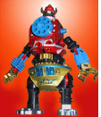
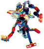
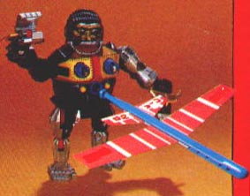
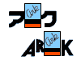
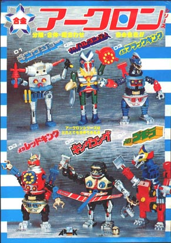

#### Diecast Toys - Manufacturers

# Ark (日本語)

**文・企画:** Matt Alt (マット・アルト)

**デザイン:** Robert Duban (ロバート・ドゥバン)

**翻訳:** Hiroko Yoda (依田寛子), Matt Alt

**公開日:** October 2000

# 失われたアーク

アークは不可思議だ。一体全体どこからやって来て、そしてどこへ消えてしまったのだ？ビニール製玩具で知られる[ブルマーク](diecast-brand-bullmark.japanese.md)と何かしら関係していそうな感じはするのだが、でもそれは唯の憶測であり真相については誰も知らない。アークについては日本の玩具エキスパート達でさえもよくわからないのである。しかし、バックグラウンドについて様々な疑問を持たせるものの、アークロン・ダイキャスト・モンスター・トイ・シリーズのデザインには目を見張るものがある！

アークロン・ダイキャストのデザインは、それを手に取る人にゆっくりと時間をかけて味わえる微妙な快感を与えてくれる。アークのダイキャストは、例外のひとつを除けばみんなウルトラマンシリーズのキャラクターであり、一見なんの変哲のない玩具に見える。が、これらの玩具をよく調べてみると、細細としたパーツがついていて、じつはこのパーツ、お互いの玩具同志で組み替えることができることがわかる。

ミサイル発射装置、回転するギアなど小さい装置が本体に装備されているだけでなく、その玩具が入っていた箱の中には、車輪、車軸、ネジを巻いて動かす乗り物、余分の手足など色々と細細としたものが入っている。それはまるで、玩具エンジニア達が、というよりモンスターが大好きな時計屋がデザインした玩具と言ったほうが良い感じがするほどである。しかし、アーク玩具の魅力ともいえるこの細かいパーツは実はとても壊れやすい。アーク玩具はプラスチック製の釘によって合金の体をつなぎ合わせているので、悲しいかな、現在存在するアーク超合金のほとんどは壊れていたり亀裂が入っていたりしている。

この玩具の興味深いところは、パーツを交換するなどして幅広く遊べるということよりも、この玩具がシリーズのキャラクターに全く似ていないところだと僕は思う。例外のキング・ジョーを除き、アークのダイキャストは大きいモンスターの機械化版なのだ。しかしダイキャストのデザイナー達はなぜ全く似ていない玩具を作ったのだろう？そのまま描写された玩具では子供達にうけないと思ったのだろうか？従来のダイキャストではゴム製のモンスターの「味」が出せないと思ったのか？それとも薬に手を出し夢でも見たのだろうか。いずれにせよ、アークはギミック、仕掛けの一番多い玩具であることは事実なのである。

日本のトイ・ファンの方々は多分びっくりされると思うが、アークロンシリーズはアメリカでも販売されていた。それも英語が印刷されている箱に入ってである。1980年代初期に、ロサンゼルスにあるマルカイ・トレーディング・カンパニー(Marukai Trading Company)という小さな輸入会社が、アークロンシリーズを私達アメリカ人に提供してくれた。しかし日本の子供達と違って、これらの玩具は私達アメリカ人にとって全くのミステリーだった。その理由は、キングコングは例外だが、これらの玩具のキャラクターについてアメリカの子供達は全く知らされていなかったからである。アークロンシリーズは、その時期棚に並べられてあったアメリカ製玩具と全く違った玩具であったと言っても過言ではない。けれど、多数のアメリカの子供達はアークには目を向けることをしなかった。その結果、アークロンシリーズは少数の子供達のカルト的対象になり、それが今日にまで至るのである。

アークのダイキャストの長所はその抽象的部分、印象的部分、そして怪獣の「look(見掛け)」ではなく「feel(感じ)」をうまく強調した、それはまるで蒸留化された「怪獣エッセンス」といえるであろう。 まるでピカソのそれのように、キャラクターのあらゆる特徴がひとつにまとまってしまっているのである。

# おもちゃリスト

* **01: King Joe (Version 1)**: キングジョーは最初のアークロンである。ポピー版のように合体することはできない｡ 全体は、塗料を使用せずに鈍い光を放つ亜鉛合金から作られ、工業から出たばかりのような感じを与える。この初期版は多量に輸出されなかった。

  * イメージ: [玩具](assets/ark-kingjoe-version1-toy.jpg), [箱](assets/ark-kingjoe-version1-box.jpg)

* **01: King Joe (Version 2)**: キングジョーには二つのバージョンがある。初期版は番組に出たものに近いけれど、後期版は太ももや上腕が赤いプラスチックに変更され、まるでピエロに見える。残念ながら、アメリカではこのセカンドバージョンしか発売されなかった。

  * イメージ: [箱](assets/ark-kingjoe-version2-box.jpg)

* **02: Mecha Baltan Seijin**: なぜ「メカバルタン」という名前をこのキャラクターにつけたのかな？ アークロンシリーズの中で、これは一番「有機体」の印象があって、ウルトラマンシリーズに出てきた実際の「メカバルタン星人」に全然似ていない。この玩具は日本で人気が高そうだけど、アメリカ人のコレクターはあまり興味がない。

  * イメージ: [玩具](assets/ark-baltanseijin-toy.jpg), [箱の中身](assets/ark-baltanseijin-innerbox.jpg), [box](assets/ark-baltanseijin-box-japan.jpg), [U.S. 箱](assets/ark-baltanseijin-box-us.jpg), [U.S. 箱の裏](assets/ark-baltanseijin-box-us-back.jpg)

* **03: Mecha Black King**: このメカブラックキングは頭が角張っていて、なんだか「用心棒怪獣」というすごいニックネームもつけて、アークロンの中の一番激しい姿だ。けれど、胴体の回転関節がものすごく壊れやすくて、衝撃を受けたらパッケージの中でも壊れる。箱に「破損注意！」と書きたいもの。

  * イメージ: [玩具](assets/ark-mechablackking-toy.jpg), [箱の中身](assets/ark-mechablackking-innerbox.jpg), [箱](assets/ark-mechablackking-box.jpg), [箱の裏](assets/ark-mechablackking-box-back.jpg), [玩具 - カラーバリエーション](assets/ark-mechablackking-toy.jpg), [箱 - カラーバリエーション](assets/ark-mechablackking-box-variations.jpg)

* **03: Mecha Red King**: メカレッドキングはアメリカでは一番人気のあるアークロンだ。アークは「どくろ怪獣」というニックネームをつけたが、頭はどくろというより、羊か牛のようにみえる。ブラックキングから開発されたようで、商品番号も同じである。兄貴分のブラックキングと同じように、胴体の関節が壊れやすすぎる。

  * イメージ: [玩具](assets/ark-mecharedking-toy.jpg), [玩具 - カラーバリエーション](assets/ark-mecharedking-toy-variations.jpg), [箱](assets/ark-mecharedking-box.jpg)

* **04: Mecha Gomora**: アークロンシリーズにおいて、メカゴモラは実際のキャラクターから一番抽象的にデフォルメされたものだろう。普通の手の代わりに、重機みたいなシャベルが接続され、首がクレーンのように伸ばすことができる。

  * イメージ: [玩具](assets/ark-mechagomora-toy.jpg)

* **04: King Kong**: キングコングはアメリカでも有名だけど、残念ながら輸入会社は著作権が取れなかったので、この玩具を「メカゴリラ」というノーブランドで発売した。日本で発売されたバージョンには鉄の玉がついたチェーンパーツ (囚人用チェーンのようなもの)が入っていたが、「メカゴリラ」のパッケージには入っていなかった。

  * イメージ: [玩具](assets/ark-kingkong-toy.jpg), [箱の裏](assets/ark-kingkong-box-back.jpg), [U.S.箱](assets/ark-kingkong-box-us.jpg), [U.S.箱の裏](assets/ark-kingkong-box-us-back.jpg)

---

[Back to Home](https://rogerharkavy.github.io/japanesetoywiki/)