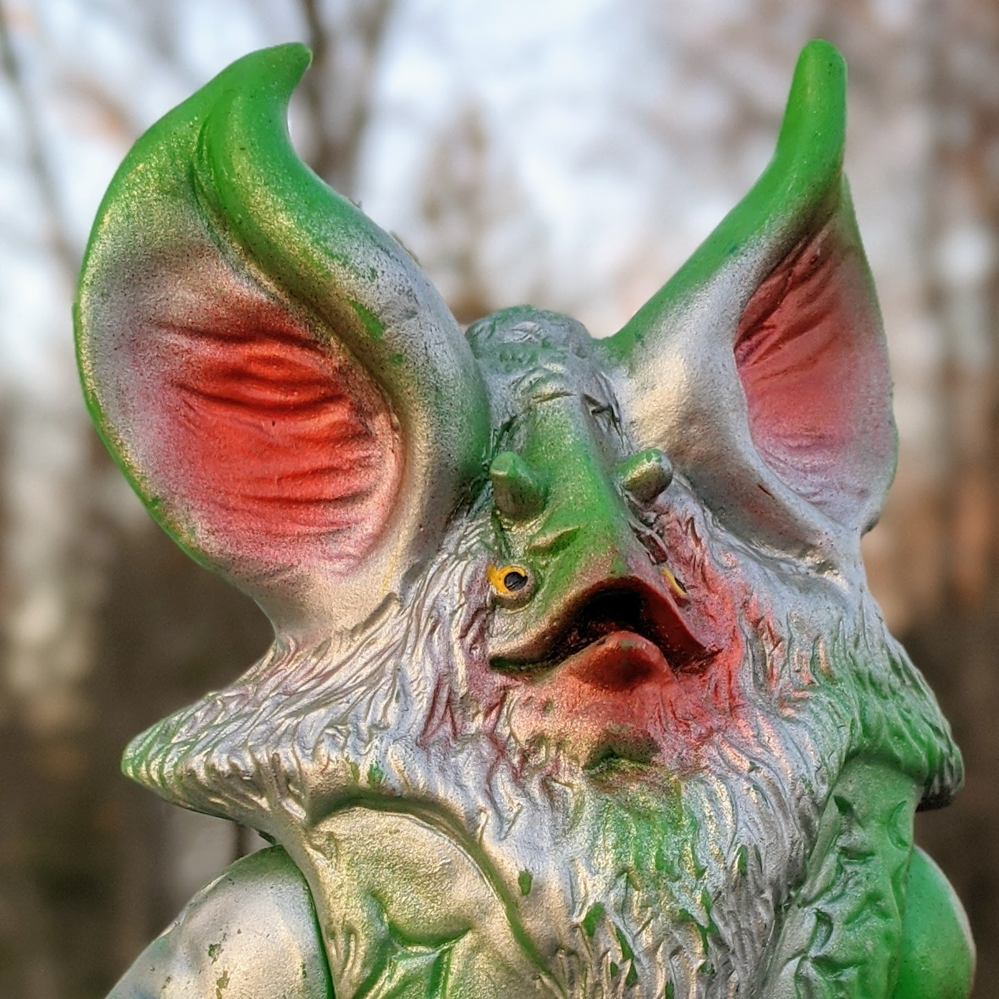

#### Vinyl Toys - Individual Toys

# Bullmark Standard Size Alien Icarus (イカルス星人)

# About

- Enemy of Ultraseven
- Standard size, 23 cm/9 in tall.
- Several variants featuring green vinyl and different paint colors are known. An export ("Hawaii") variant was sold overseas. A rare gray vinyl vintage variant exists, similar in appearance to the first reissue of the figure sold by B-Club in 2000.
- Originally sold by Marusan. Ownership of tooling was transferred to Bullmark, who added their stamp to the foot.

# Images

## Export "Hawaii" Variant

- [Front](assets/bullmark-alien-icarus-standard-export-front.jpg)
- [Left](assets/bullmark-alien-icarus-standard-export-left.jpg)
- [Right](assets/bullmark-alien-icarus-standard-export-right.jpg)
- [Back](assets/bullmark-alien-icarus-standard-export-back.jpg)
- [Feet](assets/bullmark-alien-icarus-standard-export-feet.jpg)

# Links

- [Ultrakaijyu.com: Alien Icarus](http://www.ultrakaijyu.com/ultraseven/alienicarus.html)
- [Ultraman Wiki: Alien Icarus](https://ultra.fandom.com/wiki/Alien_Icarus)
- [Instagram: Post from kaijuhoarder showing multiple Marusan and Bullmark variants](https://www.instagram.com/p/CF5i_Zhn0FW/)
- [Club Tokyo: Alien Icarus](http://clubtokyo.org/site/showManufactuerByCharacter?characterId=209)

---

[Back to Home](https://rogerharkavy.github.io/japanesetoywiki/)