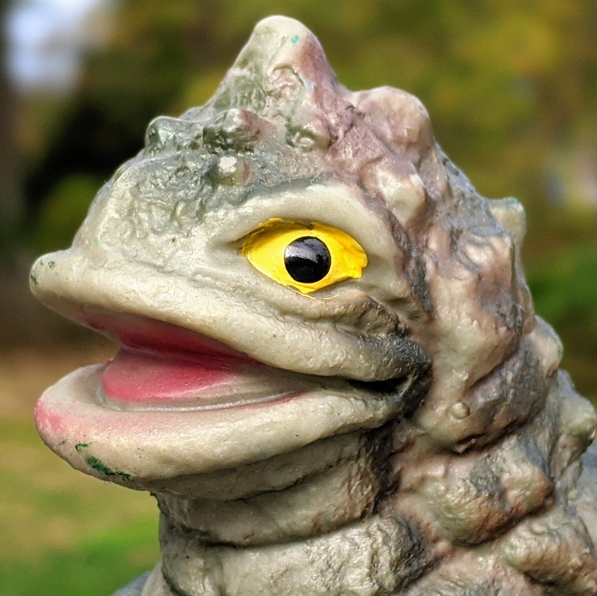
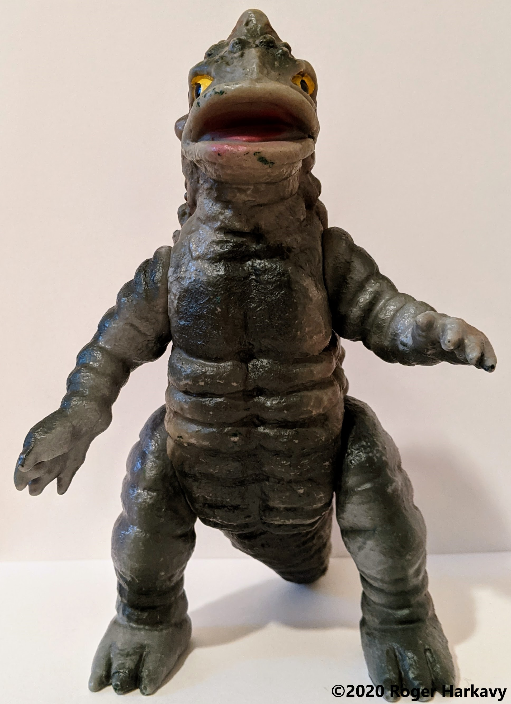
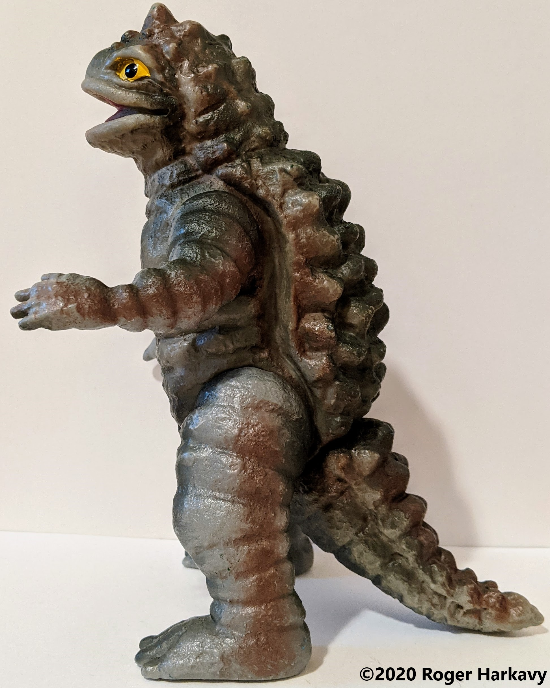
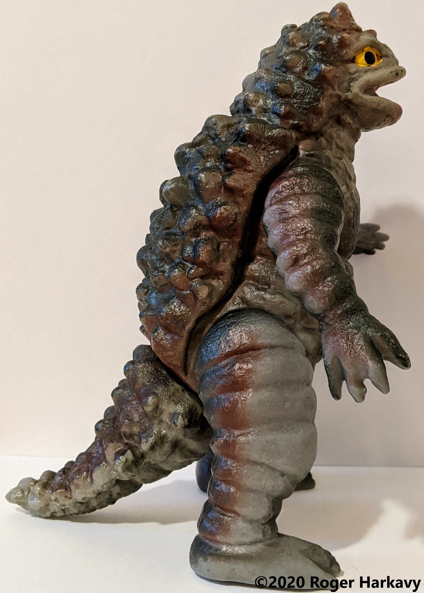
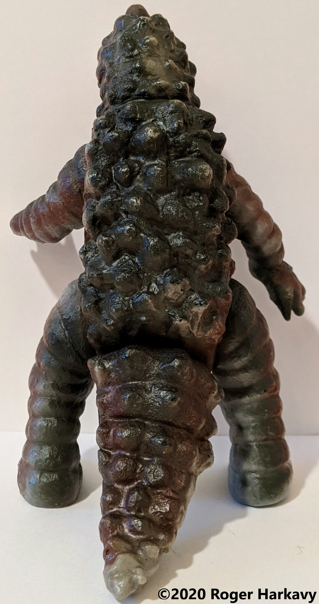
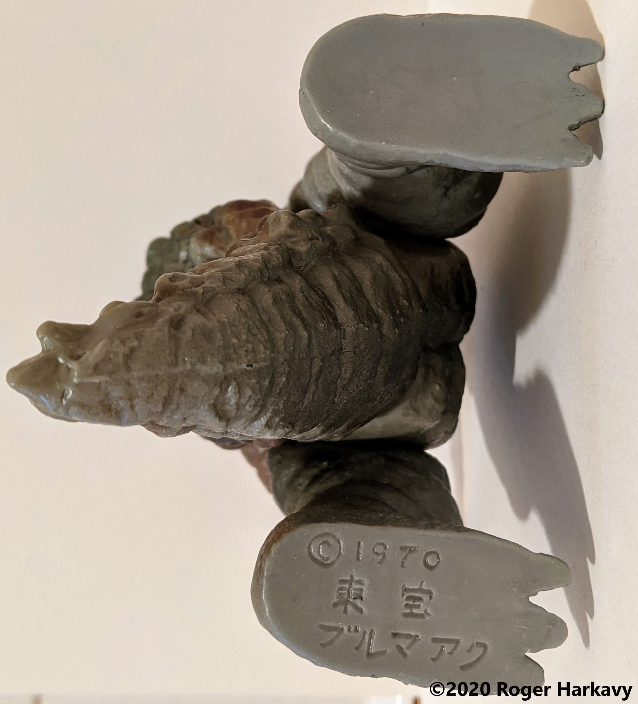

#### Vinyl Toys - Individual Toys

# Bullmark Standard Size Kameba (カメーバ )

# About

- Character from *Gezora, Ganime, Kameba: Kessen! Nankai no Daikaiju* (ゲゾラ・ガニメ・カメーバ 決戦! 南海の大怪獣), initially released in English as *Yog: Monster from Space* and later as *Space Amoeba*.
- Standard size, 23 cm/9 in tall.
- At least four distinct variants are known.

# Images

## Gray Variant

# Links

- [Wikipedia: Space Amoeba](https://en.wikipedia.org/wiki/Space_Amoeba)
- [Wikizilla: Kameobas](https://wikizilla.org/wiki/Kamoebas)
- [Instagram: Post from kaijuhoarder showing showing four variants](https://www.instagram.com/p/CFnvLWsn9Vw/)
- [Instagram: Post from kaijuhoarder showing Kameba with Ganime and Gezora](https://www.instagram.com/p/CFnvYJOnrpK/)
- [Club Tokyo: Kameba](http://clubtokyo.org/site/showManufactuerByCharacter?characterId=156)

---

[Back to Home](https://rogerharkavy.github.io/japanesetoywiki/)